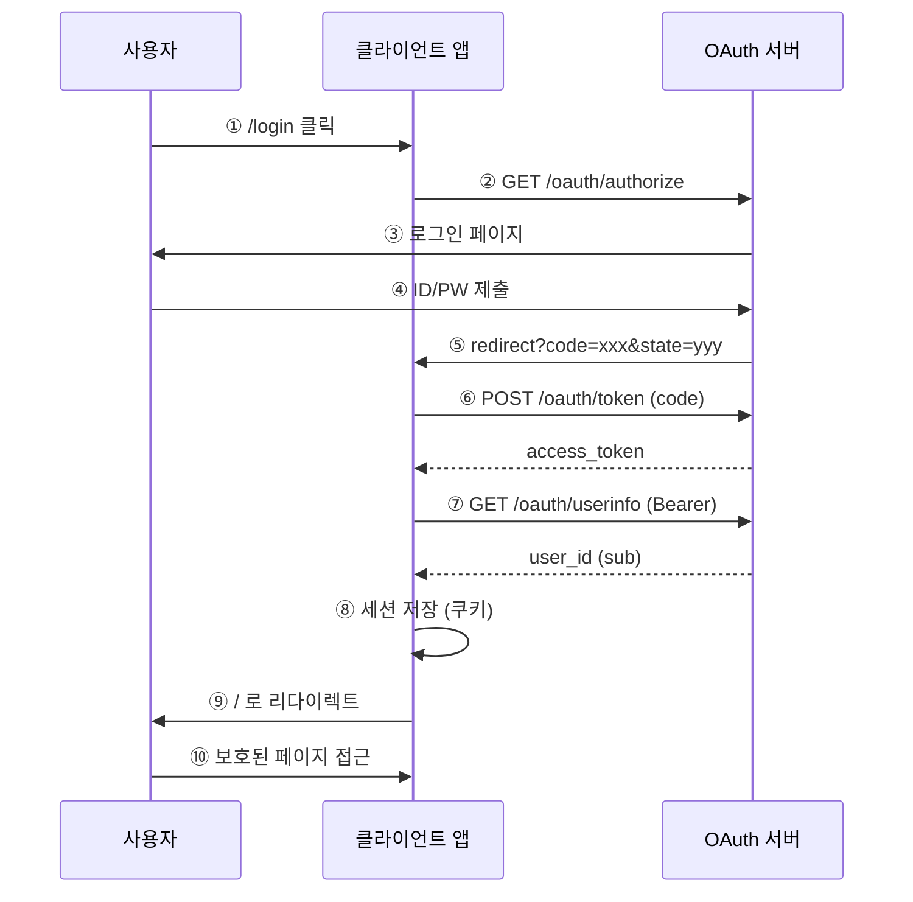

# OAuth 흐름: 등록부터 프로젝트 도입까지

## 전체 구조

```
┌─────────────┐     ┌──────────────────┐     ┌─────────────────────┐
│   사용자    │     │   클라이언트 앱   │     │   OAuth 서버         │
│  (브라우저) │     │  (내 서비스)      │     │  (server/)           │
└─────────────┘     └──────────────────┘     └─────────────────────┘
```

---

## 1️⃣ 설정 단계: OAuth 서버에 클라이언트 등록

클라이언트는 `store.Clients`에 등록됩니다. (현재 인메모리, 추후 웹 UI + DB)

| 필드 | 설명 |
|------|------|
| **서비스명** | 앱 표시 이름 |
| **서비스 설명** | 간단한 설명 |
| **메인 URL** | 서비스 대표 주소 |
| **서버 URL** | 여러 개 (추가 가능) |
| **리다이렉트 URI** | 여러 개 (OAuth 콜백 URL) |
| **client_id** | OAuth 식별자 (자동 생성 또는 지정) |
| **client_secret** | 토큰 요청 시 검증용 (자동 생성 또는 지정) |

```go
// store/clients.go - programmatic 등록
store.Clients.Register(&models.Client{
    ClientID:     "my-app",
    ClientSecret: "my-secret",
    Name:         "내 서비스",
    Description:  "서비스 설명",
    MainURL:      "https://myapp.com",
    ServerURLs:   []string{"https://api.myapp.com", "https://localhost:3000"},
    RedirectURIs: []string{"https://myapp.com/callback", "http://localhost:8081/callback"},
    OwnerID:      "user-123",
})
```

---

## 2️⃣ 프로젝트 도입: SDK 연동

클라이언트 앱 개발자가 SDK를 자신의 프로젝트에 넣을 때:

```go
// 1. OAuth 클라이언트 생성
client := ouath.New(ouath.Config{
    ServerURL:     "http://localhost:8080",  // OAuth 서버 주소
    ClientID:      "example-app",             // 등록받은 client_id
    ClientSecret:  "secret",                  // 등록받은 client_secret
    RedirectURL:   "http://localhost:8081/callback",
    Scopes:        []string{},
    SessionSecret: "32자-이상-시크릿",        // 세션 쿠키 암호화용
})

// 2. 라우트 연결
http.HandleFunc("/login", client.LoginHandler)      // 로그인 시작
http.HandleFunc("/callback", client.CallbackHandler) // OAuth 콜백
http.Handle("/", client.RequireAuth(http.HandlerFunc(home))) // 보호된 페이지
```

---

## 3️⃣ 런타임: 사용자 로그인 순서

```
사용자                클라이언트 앱              OAuth 서버
   │                        │                        │
   │  ① "로그인" 클릭        │                        │
   │ ──────────────────────>│                        │
   │                        │  ② GET /oauth/authorize │
   │                        │  (client_id, redirect_uri, state) │
   │                        │ ──────────────────────>│
   │                        │                        │
   │  ③ 로그인 페이지로 리다이렉트                     │
   │ <───────────────────────────────────────────────│
   │                        │                        │
   │  ④ 아이디/비밀번호 입력  │                        │
   │ ──────────────────────────────────────────────>│
   │                        │                        │
   │  ⑤ redirect_uri?code=xxx&state=yyy              │
   │ <──────────────────────│                        │
   │     (콜백 URL로 리다이렉트)                      │
   │                        │                        │
   │  ⑥ GET /callback        │                        │
   │ ──────────────────────>│                        │
   │                        │  ⑦ POST /oauth/token   │
   │                        │     (code → access_token) │
   │                        │ ──────────────────────>│
   │                        │                        │
   │                        │  ⑧ GET /oauth/userinfo │
   │                        │     (Bearer token)     │
   │                        │ ──────────────────────>│
   │                        │                        │
   │                        │  ⑨ 세션에 user_id, access_token 저장
   │                        │     쿠키 설정 후 / 로 리다이렉트
   │                        │                        │
   │  ⑩ 보호된 페이지 접근    │                        │
   │ <─────────────────────│                        │
```

---

## 엔드포인트 요약

| 엔드포인트 | 용도 |
|------------|------|
| `GET /oauth/authorize` | 로그인 페이지 표시 (client_id 검증) |
| `POST /oauth/login` | ID/PW 확인 후 auth code 발급, redirect_uri로 리다이렉트 |
| `POST /oauth/token` | code → access_token 교환 (Basic Auth 필요) |
| `GET /oauth/userinfo` | access_token으로 사용자 정보 조회 |

---

## Mermaid 시퀀스 다이어그램


